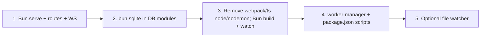

# Switch to Bun: native HTTP, WebSocket, SQLite, toolchain (no webpack/ts-node/nodemon)

## Current state

- **HTTP/WS**: [server/start.ts](server/start.ts) uses Fastify with `@fastify/static` and `@fastify/websocket`. Routes: `GET /ping`, `/encode/:context/:mime`, `/stats`, `/thumbnail/*`, `/asset/*`, static files from `public/`, WebSocket at `/cmd`.
- **SQLite**: Node's experimental `node:sqlite` (`DatabaseSync`) with `--experimental-sqlite`. Used in walker, search, exif, geolocate database modules.
- **File watching**: Polling loop in `startAlbumUpdateNotification()`; optional enhancement with native fs watch.
- **Workers**: [server/worker-manager.ts](server/worker-manager.ts) spawns Node `worker_threads` with `--experimental-sqlite` and (in dev) `ts-node/register`.
- **Client build**: [webpack.config.js](webpack.config.js) bundles `client/app.ts` with ts-loader → `public/dist/app.js`. Scripts: `build:client` (webpack prod), `start:webpack` (webpack watch).
- **Server dev**: `start:server` uses nodemon watching `./shared` and `./server`, running `ts-node -P tsconfig-server.json server/index.ts`.
- **Other ts-node usage**: `build:rpc` runs `ts-node server/rpc/generate.ts`; `start-fav` runs a ts-node script.

---

## 1. Replace Fastify with Bun.serve

**File: [server/start.ts](server/start.ts)**

- Remove Fastify, `@fastify/static`, `@fastify/websocket`. Create a single `Bun.serve()` with:
  - **fetch(req, server)**: Route by `req.url` (and method). Serve static files from `public/` using `Bun.file(join(publicDir, pathname))` and return `new Response(file)`. For unknown paths, try static first, then 404.
  - **WebSocket**: In the fetch handler, if path is `/cmd`, call `server.upgrade(req, { data: ... })` and return; implement `websocket: { open(ws), message(ws, msg), close(ws), drain(ws) }`. Reuse [shared/rpc-transport/ws-adaptor.ts](shared/rpc-transport/ws-adaptor.ts) by wrapping Bun's `ServerWebSocket` so it exposes `send`, `onmessage`, `onclose`, `onerror`, `readyState`.
  - **Routes**: Same URLs as today (`/ping`, `/encode/...`, `/stats`, `/thumbnail/...`, `/asset/...`). Run busy/preHandler logic at the start of fetch.
- **Options**: `port`, `hostname: "0.0.0.0"`, `maxRequestBodySize: 50 * 1024 * 1024`.
- **Static and 404**: Resolve pathname against `public/`, reject path traversal; if file exists return it, else 404.
- **Asset route**: Return `Bun.file(path)` with correct `Content-Type` (and optional `Content-Disposition`).

---

## 2. Switch to native Bun SQLite (bun:sqlite)

**API mapping (Node → Bun)**

- `import { DatabaseSync } from "node:sqlite"` → `import { Database } from "bun:sqlite"`.
- `new DatabaseSync(path, { mode: "readonly" })` → `new Database(path, { readonly: true })`; for read-write use default or `{ create: true }`.
- `db.prepare(sql)` → `db.prepare(sql)` (or `db.query(sql)` where caching is desired).
- `stmt.get()`, `stmt.all(...)`, `stmt.run(...)` → same.
- `db.exec(sql)` → `db.run(sql)` (Bun supports multi-statement in `run`).

**Files to update**

- [server/services/walker/internal/database.ts](server/services/walker/internal/database.ts)
- [server/services/search/database.ts](server/services/search/database.ts) and [server/services/search/internal/database.ts](server/services/search/internal/database.ts)
- [server/services/exif/internal/database.ts](server/services/exif/internal/database.ts)
- [server/services/geolocate/internal/database.ts](server/services/geolocate/internal/database.ts) and [server/services/geolocate/internal/poi/poi-database.ts](server/services/geolocate/internal/poi/poi-database.ts)

**Worker and scripts**

- [server/worker-manager.ts](server/worker-manager.ts): Remove `--experimental-sqlite` and `-r ts-node/register` from `execArgv`. Workers run under Bun (e.g. `bun run worker.ts` or Bun’s worker API) and use `bun:sqlite` directly.
- [package.json](package.json): Remove `NODE_OPTIONS='--experimental-sqlite'` from all scripts; use `bun run` / `bun` for server and build scripts.

---

## 3. Remove webpack, ts-node, nodemon; use Bun build, hot-reload, and watch

### 3.1 Remove packages

- **Remove from devDependencies**: `webpack`, `webpack-cli`, `ts-loader`, `ts-node`, `nodemon`.
- **Keep**: TypeScript, types, and other devDependencies (electron, png2icons, etc.).

### 3.2 Client build: replace webpack with Bun.build

- **Current**: Webpack bundles `client/app.ts` → `public/dist/app.js` (with ts-loader, source maps).
- **New**: Use Bun’s bundler to produce the client bundle.
  - **Option A – CLI**: `bun build client/app.ts --outdir public/dist --minify` (prod) and `bun build client/app.ts --outdir public/dist --watch` (dev watch). Output filename: set via `--target=browser` and ensure entry is `client/app.ts`; Bun defaults to `app.js` when entry is `app.ts` in some setups, so verify output name and adjust HTML if needed (e.g. `public/index.html` or similar that loads `dist/app.js`).
  - **Option B – build script**: Small script that calls `Bun.build({ entrypoints: ['./client/app.ts'], outdir: './public/dist', target: 'browser', sourcemap: 'external' })` and run it with `bun run build:client.ts`; for watch use `bun --watch run build:client.ts` (restarts script on change; for true incremental client watch, prefer CLI `bun build ... --watch` when available).
- **Delete** [webpack.config.js](webpack.config.js) and remove any references to webpack/ts-loader in configs.
- **package.json**: `build:client` → `bun build client/app.ts --outdir public/dist` (add `--minify` for prod). `start:client` or equivalent for dev: `bun build client/app.ts --outdir public/dist --watch` so client rebuilds on change without webpack.

### 3.3 Server dev: replace nodemon + ts-node with Bun watch / hot

- **Current**: `start:server` = `nodemon -e ts --watch ./shared --watch ./server -x "ts-node -P tsconfig-server.json server/index.ts"`.
- **New**: Run the server with Bun and use watch or hot reload.
  - **Watch (full restart)**: `bun --watch server/index.ts` — restarts the process when files change (Bun watches the entry and its dependencies). Equivalent to nodemon + ts-node.
  - **Hot (soft reload)**: `bun --hot server/index.ts` — updates module cache without full process restart; use when you want faster feedback and can tolerate possible state quirks.
- **package.json**: `start:server` → e.g. `bun --watch server/index.ts` (or `bun --hot server/index.ts`). Pass env as today: `DEBUG='*' PICISA_PICTURE_FOLDER=... bun --watch server/index.ts`. Drop `NODE_OPTIONS='--experimental-sqlite'`.

### 3.4 Other scripts that used ts-node

- **build:rpc**: Currently `NODE_OPTIONS='--experimental-sqlite' ts-node server/rpc/generate.ts client/rpc/generated-rpc`. Change to `bun server/rpc/generate.ts client/rpc/generated-rpc` (no sqlite in that script; no ts-node).
- **start-fav**: Currently `ts-node --esm server/rpc/rpcFunctions/fileJob-export-favorites.ts`. Change to `bun server/rpc/rpcFunctions/fileJob-export-favorites.ts`.

### 3.5 package.json script summary

- `build`: Keep `native-filters`; `build:server` can stay `tsc -d -p tsconfig-server.json` for type-checking/emit if you still want `dist/` for Electron, or switch to `bun build` for server if you no longer need tsc output.
- `build:client`: `bun build client/app.ts --outdir public/dist` (add `--minify` for production build).
- `build:rpc`: `bun server/rpc/generate.ts client/rpc/generated-rpc`.
- `start`: Use `run-p start:*` (or sequential) with `start:client` and `start:server`.
- `start:client`: `bun build client/app.ts --outdir public/dist --watch`.
- `start:server`: `bun --watch server/index.ts` (with required env vars).
- Remove all `NODE_OPTIONS='--experimental-sqlite'` and any `nodemon` / `ts-node` usage.

### 3.6 main/browser and Electron

- **main**: Today `main` points to `dist/server/main.js` (compiled server). If Electron or something else expects `dist/`, keep building server to `dist/` (e.g. with `tsc` or `bun build`) or point `main` to `server/index.ts` and run with Bun when not using Electron.
- **browser**: Today `browser` is `dist/src/index.js`; client is actually served from `public/dist/app.js` via webpack. After migration, the “browser” entry is the Bun-built bundle in `public/dist/app.js`; update or remove the `browser` field if it’s only for tooling and no longer accurate.

### 3.7 native-filters subpackage

- [server/imageOperations/native-filters/package.json](server/imageOperations/native-filters/package.json) uses ts-node for its `start` script. Replace with `bun index.ts` (or the actual entry). If that package is built with a separate npm script, keep using Bun there too and remove ts-node from its devDependencies.

---

## 4. File watcher (optional)

- **Current**: Album change notifications are worker-driven via `queueNotification` and a polling loop in `startAlbumUpdateNotification()`.
- **Option A**: Leave as-is; just run on Bun.
- **Option B**: Add `fs.watch(imagesRoot, { recursive: true }, ...)` (or Bun equivalent) to push filesystem-driven `AlbumChangeEvent` into the same queue/event bus; debounce to avoid flooding.

---

## 5. Dependencies and toolchain summary

- **Remove**: `fastify`, `@fastify/static`, `@fastify/websocket`; `webpack`, `webpack-cli`, `ts-loader`, `ts-node`, `nodemon`.
- **Keep**: `sharp`, `debug`, TypeScript, and other deps that don’t require Node-only APIs.
- **Add**: Ensure Bun is available (e.g. `bun` in devDependencies or documented requirement). Add `bun-types` if needed for TypeScript.
- **Workers**: Spawn with Bun (no ts-node, no --experimental-sqlite); workers use `bun:sqlite`.

---

## 6. Electron and build

- Standalone server runs on Bun (Bun.serve + bun:sqlite + Bun watch/hot). Electron packaging can remain as-is (Node inside Electron) unless you later move to embedding Bun or spawning a Bun process for the in-app server.

---

## 7. Order of work

1. Implement Bun.serve in [server/start.ts](server/start.ts); verify HTTP routes, static files, and WebSocket RPC on `/cmd`.
2. Replace `node:sqlite` with `bun:sqlite` in all database modules; remove `--experimental-sqlite` from workers and scripts.
3. Remove webpack/ts-node/nodemon: add Bun client build and `bun --watch` / `bun --hot` for server; update `build:rpc` and `start-fav`; delete webpack.config.js; update native-filters if it uses ts-node.
4. Update [package.json](package.json) scripts and [server/worker-manager.ts](server/worker-manager.ts); run and test `bun run start` (client watch + server watch).
5. Optionally add fs watcher for the photos directory.

---

## Risks and notes

- **Bun.build client**: Confirm output path and filename match what the HTML (or Electron) expects (e.g. `public/dist/app.js`). Enable source maps if needed (`sourcemap: 'external'` or `--sourcemap=external`).
- **Worker threads**: Run workers under Bun so they can use `bun:sqlite`; remove ts-node and experimental-sqlite from worker spawn options.
- **RPC over WebSocket**: Bun WebSocket wrapper must match the `send` / `onmessage` / `onclose` / `readyState` contract expected by [shared/rpc-transport/ws-adaptor.ts](shared/rpc-transport/ws-adaptor.ts).
