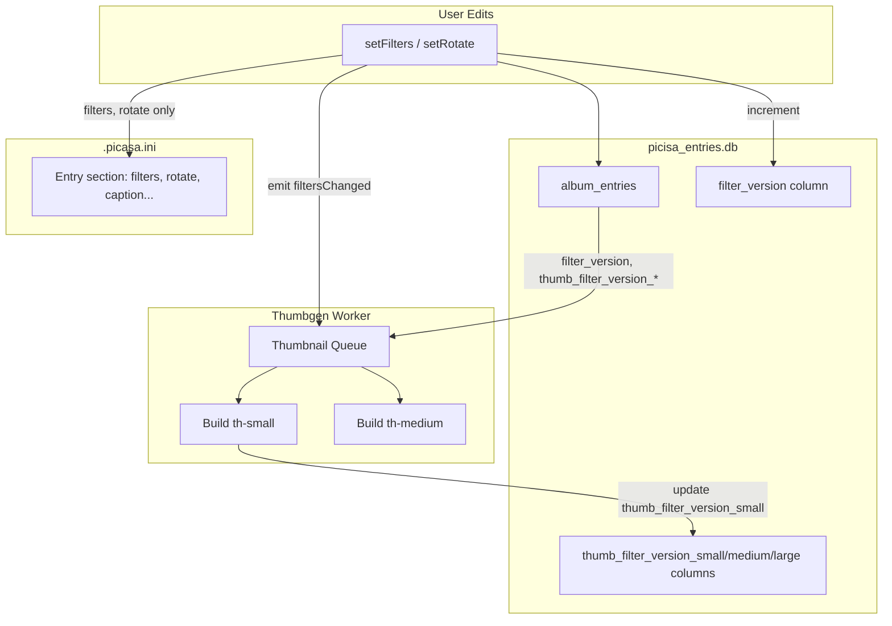

# Thumbnail Filter Version Invalidation Plan

> **For Claude:** REQUIRED SUB-SKILL: Use superpowers:executing-plans to implement this plan task-by-task.

**Goal:** Replace per-thumbnail cached metadata with a single `filter_version` column for invalidation. Thumbnails are queued on startup (small/medium only), high-res on demand only, and low/mid on change or on demand. Remove cached thumbnail fields from .picasa.ini.

**Architecture:**

- `album_entries.filter_version` (INTEGER, default 0): incremented whenever `filters` or `rotate` change
- `album_entries.thumb_filter_version_small`, `thumb_filter_version_medium`, `thumb_filter_version_large` (INTEGER, default -1): dedicated columns storing which filter_version was used when each thumbnail was built. Use -1 to mean "never built" or "needs rebuild".
- Thumbgen worker: owns a `Queue` (from `shared/lib/queue`). On startup, iterate entries where `thumb_filter_version_X` < `filter_version` or thumb file missing, enqueue small+medium. High-res built only when requested.
- When `filtersChanged`/`rotateChanged`: enqueue small+medium for that entry (whichever comes first with on-demand)

**Tech Stack:** Bun, SQLite (picisa_entries.db), existing Queue, server events

---

## Data Flow

---

## Task 1: Add filter_version and thumb_filter_version columns

**Files:**

- Modify: [server/services/entries/internal/database.ts](server/services/entries/internal/database.ts)

**Steps:**

1. Add migration that adds to `album_entries`:
  - `filter_version INTEGER NOT NULL DEFAULT 0`
  - `thumb_filter_version_small INTEGER NOT NULL DEFAULT -1`
  - `thumb_filter_version_medium INTEGER NOT NULL DEFAULT -1`
  - `thumb_filter_version_large INTEGER NOT NULL DEFAULT -1`
2. Add index on `filter_version` to speed up "entries needing thumbnails" query (filters out unedited entries with filter_version=0).
3. Add index on `(thumb_filter_version_small, filter_version)` and `(thumb_filter_version_medium, filter_version)` for the startup query.
4. Call migration from `checkAndMigrateDatabase()` path.

---

## Task 2: Increment filter_version when filters or rotate change

**Files:**

- Modify: [server/services/entries/internal/database.ts](server/services/entries/internal/database.ts) — `updateEntryMetadata`
- Modify: [server/services/walker/internal/mutations.ts](server/services/walker/internal/mutations.ts) — ensure filters/rotate path triggers increment

**Steps:**

1. In `updateEntryMetadata`, when the update touches `filters` or `rotate`, add `filter_version = filter_version + 1` to the UPDATE.
2. Ensure `setFilters` and `setRotate` in mutations go through `updateEntryMetadata` (they already do).

---

## Task 3: Stop writing cached thumbnail fields to picasa.ini

**Files:**

- Modify: [server/services/walker/internal/picasa-ini.ts](server/services/walker/internal/picasa-ini.ts)
- Modify: [server/services/walker/internal/mutations.ts](server/services/walker/internal/mutations.ts) if needed

**Steps:**

1. Define `CACHE_FIELD_PREFIXES = ['cached:', 'thumb_filter_version:']` (legacy; thumb_filter_version is now DB columns only)
2. In `updatePicasaEntry` (or in the data passed to `writePicasaIni`), strip keys matching `cached:`* before writing to picasa.
3. In `dataFix`, strip any existing `cached:`* keys when reading so they are never persisted back.
4. Ensure `updateEntryMetadata` still writes full metadata to DB; only picasa.ini excludes cache fields.

---

## Task 4: Add updateThumbFilterVersion for thumbgen

**Files:**

- Modify: [server/services/entries/internal/database.ts](server/services/entries/internal/database.ts)
- Modify: [server/services/entries/internal/database.ts](server/services/entries/internal/database.ts) — add thumbgen to isWriter list

**Steps:**

1. Add `updateThumbFilterVersion(entry, size, filterVersion)` that updates only the corresponding `thumb_filter_version_X` column.
2. Add thumbgen to the list of writers for entries DB (`serviceName === "thumbgen"`) so thumbgen can call this after building a thumbnail.
3. This is a narrow write: only touches thumb_filter_version columns, no picasa.ini.

---

## Task 5: Rewrite shouldMakeThumbnail to use filter_version

**Files:**

- Modify: [server/rpc/rpcFunctions/thumbnail-cache.ts](server/rpc/rpcFunctions/thumbnail-cache.ts)

**Steps:**

1. `shouldMakeThumbnail(entry, size, animated)`:
  - Get `filter_version` and `thumb_filter_version_X` from DB (via `getEntryMetadata` or direct query — metadata will need to expose these).
2. Extend `getEntryMetadata` (or add a dedicated query) to return `filter_version` and `thumb_filter_version_small/medium/large`.
3. Invalidation logic:
  - If thumb file missing → true
  - If source mtime > thumb mtime → true
  - If thumb file size 0 → true
  - If `thumb_filter_version_X < filter_version` (or thumb_filter_version_X is -1) → true
  - Else → false
4. Remove use of `cachedFilterKey`, `dimensionsFilterKey`, `rotateFilterKey` for invalidation.

---

## Task 6: Replace updateCacheData with updateThumbFilterVersion

**Files:**

- Modify: [server/rpc/rpcFunctions/thumbnail.ts](server/rpc/rpcFunctions/thumbnail.ts) — `makeImageThumbnail`, `makeVideoThumbnail`
- Modify: [server/rpc/rpcFunctions/thumbnail-cache.ts](server/rpc/rpcFunctions/thumbnail-cache.ts) — remove `updateCacheData`, add `updateThumbFilterVersion` export

**Steps:**

1. Before building a thumbnail, read `filter_version` from `getEntryMetadata` (or DB).
2. After building, call `updateThumbFilterVersion(entry, size, filter_version)` instead of `updateCacheData`.
3. Remove `updateCacheData` and its use of cached:* keys.
4. Update `makeImageThumbnail` and `makeVideoThumbnail` accordingly.

---

## Task 7: Update extraFields type and remove cached keys

**Files:**

- Modify: [shared/types/types.ts](shared/types/types.ts)
- Modify: [server/services/walker/internal/picasa-ini.ts](server/services/walker/internal/picasa-ini.ts) — remove exports of `cachedFilterKey`, `dimensionsFilterKey`, `rotateFilterKey` if unused

**Steps:**

1. Remove `cached:filters`, `cached:dimensions`, `cached:rotate` from `extraFields` type.
2. Remove `thumb_filter_version:`* from extraFields (now dedicated columns).
3. Remove or deprecate `cachedFilterKey`, `dimensionsFilterKey`, `rotateFilterKey` exports.

---

## Task 8: Thumbgen queue and startup iteration

**Files:**

- Modify: [server/services/thumbgen/internal/worker-thread.ts](server/services/thumbgen/internal/worker-thread.ts)
- Modify: [server/services/entries/internal/database.ts](server/services/entries/internal/database.ts) — add query for entries needing thumbnails

**Steps:**

1. Add `getEntriesNeedingThumbnails(sizes: ThumbnailSize[])` to entries DB:
  - Returns `{ album_key, entry_name }[]` where for each size, `thumb_filter_version_X < filter_version` OR `thumb_filter_version_X = -1`.
  - Use indexed columns for efficient query.
2. In thumbgen worker:
  - Create `thumbnailQueue = new Queue(concurrency, { fifo: true })` (e.g. concurrency 4).
  - On startup, after DB is ready: call `getEntriesNeedingThumbnails(['th-small','th-medium'])`, enqueue each `(entry, size)` task.
  - Each task: `makeThumbnailIfNeeded(entry, size, animated)` for both animated variants.
  - Do NOT enqueue th-large on startup.
3. Keep `albumEntryAdded` handler: enqueue small+medium for new entries.
4. Replace the initial synchronous loop over all albums with: enqueue from `getEntriesNeedingThumbnails`, then process queue (optionally `await thumbnailQueue.drain()` or run in background without blocking ready).

---

## Task 9: Enqueue on filtersChanged/rotateChanged

**Files:**

- Modify: [server/services/thumbgen/internal/worker-thread.ts](server/services/thumbgen/internal/worker-thread.ts)

**Steps:**

1. Listen for `filtersChanged` and `rotateChanged` (both include `entry`).
2. On event: enqueue small+medium thumbnail build for that entry.
3. On-demand requests (from `readOrMakeThumbnail`) already call `makeThumbnailIfNeeded` — they will run immediately; duplicate work is acceptable for now.

---

## Task 10: High-res on demand only

**Files:**

- Modify: [server/services/thumbgen/internal/worker-thread.ts](server/services/thumbgen/internal/worker-thread.ts)

**Steps:**

1. Ensure `getEntriesNeedingThumbnails` is never called with `th-large`.
2. Ensure `albumEntryAdded` and `filtersChanged`/`rotateChanged` only enqueue th-small and th-medium.
3. `readOrMakeThumbnail` / `makeThumbnailIfNeeded` for th-large continues to work on-demand (no change needed).

---

## Task 11: dataFix to strip cached keys from picasa.ini on read

**Files:**

- Modify: [server/services/walker/internal/picasa-ini.ts](server/services/walker/internal/picasa-ini.ts)

**Steps:**

1. In `dataFix`, when iterating entry sections, delete keys matching `cached:`* so they are never written back to picasa.ini.

---

## Index Strategy

- **filter_version**: Index helps when most entries have `filter_version = 0`; query can quickly find edited entries.
- **thumb_filter_version columns**: Composite indexes `(thumb_filter_version_small, filter_version)` and `(thumb_filter_version_medium, filter_version)` support the startup query `WHERE thumb_filter_version_X < filter_version OR thumb_filter_version_X = -1`.

---

## Testing and Verification

- Run `bun run build`
- Start app, change filters on an image, verify thumbnails rebuild
- Verify .picasa.ini no longer contains `cached:filters`, `cached:dimensions`, `cached:rotate`
- Verify th-large only generated when explicitly requested (e.g. open large view)

